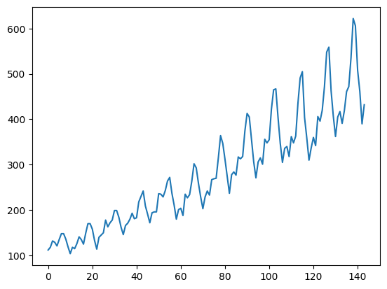

# ✈️ AirPassPro: Airline Passenger Forecasting 📈


> Predict future airline passenger numbers with state-of-the-art LSTM neural networks

## 🚀 Overview

**AirPassPro** uses Long Short-Term Memory (LSTM) neural networks to forecast airline passenger numbers based on historical data. This project demonstrates advanced time series forecasting techniques with TensorFlow, perfect for data scientists and ML engineers interested in predictive analytics.

<details>
<summary>📊 Dataset Visualization</summary>


</details>

## ✨ Key Features

- 🔍 Data preprocessing pipeline with MinMaxScaler normalization
- 🧠 LSTM architecture optimized for time series forecasting
- 📏 Configurable historical window (look_back parameter)
- 📊 Comprehensive evaluation metrics (RMSE)
- 🔄 Train/test split methodology for robust validation

## 📦 Installation

### Prerequisites

- Python 3.10+
- pip package manager

### Setup Environment

```bash
# Clone the repository
git clone <repository_link>
cd <Folder_name>

# Create and activate a virtual environment
python -m venv venv
# On Windows:
venv\Scripts\activate
# On macOS/Linux:
source venv/bin/activate
```
```bash
# Install required packages
pip install -r requirements.txt
```

## 💻 Usage

### Run the Jupyter Notebook

```bash
# Navigate to the notebooks directory
cd notebooks

# Launch Jupyter Notebook
jupyter notebook airline_passengers_forecasting.ipynb
```

### Run as Python Script

```bash
# Convert notebook to Python script (optional)
jupyter nbconvert --to script airline_passengers_forecasting.ipynb

# Run the script
python airline_passengers_forecasting.py
```

## 📊 Dataset

The project uses the international airline passengers dataset, which contains monthly totals of international airline passengers from 1949 to 1960.

### Dataset Structure

- **Format**: CSV
- **Features**: Monthly passenger count
- **Timespan**: 144 months
- **Location**: `data/raw/international_airline_passengers.csv`

## 🧠 Model Architecture

```
Model: "sequential"
_________________________________________________________________
Layer (type)                Output Shape              Param #   
=================================================================
lstm (LSTM)                 (None, 4)                 128       
_________________________________________________________________
dense (Dense)               (None, 1)                 5         
=================================================================
Total params: 133
Trainable params: 133
Non-trainable params: 0
_________________________________________________________________
```

## 📈 Results

The model achieves the following performance metrics:

| Metric | Training Set | Testing Set |
|--------|-------------|------------|
| RMSE   | ~64.60      | ~206.90    |

## 🔧 Customization

### Adjust the Look-Back Window

```python
# Change the number of previous time steps to consider
look_back = 5  # Default is 3

# Recreate datasets with new look_back value
trainX, trainY = create_dataset(train, look_back)
testX, testY = create_dataset(test, look_back)

# Remember to reshape the input data accordingly
trainX = np.reshape(trainX, (trainX.shape[0], 1, trainX.shape[1]))
testX = np.reshape(testX, (testX.shape[0], 1, testX.shape[1]))
```

### Modify the LSTM Architecture

```python
# Create a deeper LSTM model
model = Sequential()
model.add(LSTM(8, input_shape=(1, look_back), return_sequences=True))
model.add(LSTM(4))
model.add(Dense(1))
model.compile(loss="mean_squared_error", optimizer="adam")
```


## 🙏 Acknowledgements

- International airlines passenger dataset providers
- TensorFlow and Keras development team
- Scikit-learn contributors
- Dave (Datalumina)

---

<p align="center">
  Made with ❤️ by Sahil Thorat
</p>
